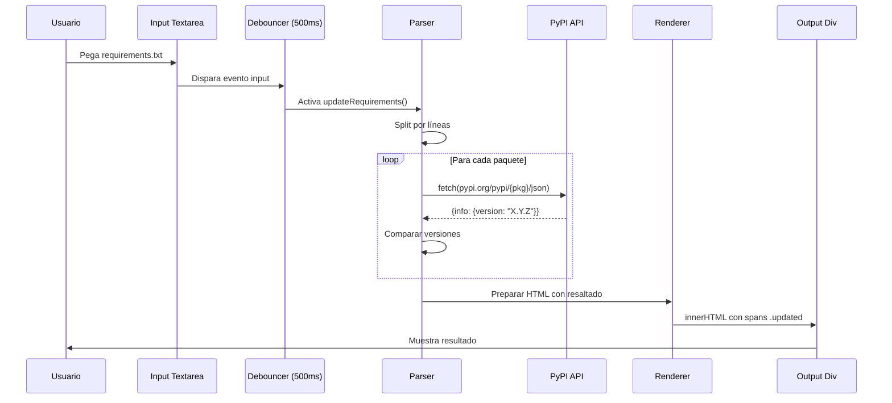

# Requirements Updater Development Agent

## 🎯 Propósito

Este agente está diseñado para asistir en el desarrollo, mantenimiento y mejora del proyecto **Requirements Updater**, una herramienta web que actualiza automáticamente las dependencias de archivos `requirements.txt` de Python consultando la API de PyPI.

---

## 📋 Contexto del Proyecto

### Información General

- **Nombre**: Requirements Updater
- **Organización**: Party-Tools
- **Repositorio**: https://github.com/Party-Tools/requirements-updater
- **Demo Live**: https://party-tools.github.io/requirements-updater/
- **Tipo**: Single Page Application (SPA)
- **Fork de**: azurda/azurda.github.io
- **Estado**: Producción activa en GitHub Pages

### Stack Tecnológico

```yaml
frontend:
  - HTML5 (estructura semántica)
  - CSS3 (variables CSS, modo oscuro)
  - JavaScript Vanilla (ES6+, sin frameworks)
  
apis:
  - PyPI JSON API (https://pypi.org/pypi/{package}/json)
  
hosting:
  - GitHub Pages
  - Dominio: party-tools.github.io
  
arquitectura:
  - Single File Application (index.html contiene todo)
  - Client-Side Only (sin backend)
  - Zero Dependencies (no npm, no bundlers)
```

---

## 🏗️ Arquitectura Técnica

### Estructura del Código

```
index.html
├── <head>
│   ├── Meta tags (charset, viewport, description, keywords)
│   └── <style> (CSS embebido)
│       ├── :root (variables CSS para temas)
│       ├── .dark-mode (variables para modo oscuro)
│       ├── Layout styles (flexbox, responsive)
│       └── Component styles (textarea, buttons, etc.)
│
└── <body>
    ├── Dark Mode Toggle Button
    ├── Header (título y descripción)
    ├── .container (flexbox 2 columnas)
    │   ├── .input (panel izquierdo)
    │   │   ├── Título
    │   │   ├── Textarea input
    │   │   └── Status indicator
    │   └── .output (panel derecho)
    │       ├── Título
    │       └── Div contenteditable (output)
    ├── Ko-fi Banner (soporte)
    └── <script> (JavaScript embebido)
        ├── Event Listeners
        ├── toggleDarkMode()
        ├── updateRequirements() [async]
        ├── getLatestVersion() [async]
        └── debounce() [utility]
```

### Flujo de Datos



### Componentes Clave

#### 1. Input Handler
```javascript
// Escucha con debouncing para optimizar
inputElement.addEventListener('input', debounce(updateRequirements, 500));
```

#### 2. PyPI Fetcher
```javascript
async function getLatestVersion(packageName) {
    const response = await fetch(`https://pypi.org/pypi/${packageName}/json`);
    const data = await response.json();
    return data.info.version;
}
```

#### 3. Requirements Parser
```javascript
// Parsea líneas tipo: "flask==2.0.1"
const [packageName, currentVersion] = trimmedLine.split('==');
```

#### 4. Output Renderer
```javascript
// Resalta actualizaciones con <span class="updated">
if (latestVersion !== currentVersion) {
    updatedLines.push(`<span class="updated">${updatedLine}</span>`);
}
```

---

## 🎨 Sistema de Diseño

### Paleta de Colores

```css
/* Modo Claro */
:root {
    --bg-color: #f0f0f0;           /* Fondo general */
    --container-bg: white;          /* Fondo contenedores */
    --text-color: black;            /* Texto principal */
    --border-color: #ccc;           /* Bordes */
    --updated-bg: #90EE90;          /* Resaltado actualizaciones (verde claro) */
}

/* Modo Oscuro */
.dark-mode {
    --bg-color: #2c2c2c;           /* Fondo general oscuro */
    --container-bg: #363636;        /* Fondo contenedores oscuro */
    --text-color: #e0e0e0;          /* Texto claro */
    --border-color: #555;           /* Bordes grises */
    --updated-bg: #4CAF50;          /* Resaltado actualizaciones (verde intenso) */
}
```

### Tipografía

```css
body {
    font-family: Arial, sans-serif;
}

textarea, #output-requirements {
    font-family: monospace;  /* Crucial para código */
}
```

### Layout Responsivo

```css
.container {
    display: flex;
    width: 90%;
    max-width: 1200px;
}

.input, .output {
    flex: 1;  /* 50% cada panel */
}
```

---

## 🔧 Funcionalidades Implementadas

### ✅ Core Features

1. **Actualización Automática**
   - Parseo de `requirements.txt`
   - Consulta a PyPI API
   - Comparación de versiones
   - Resaltado visual de cambios

2. **Modo Oscuro**
   - Toggle manual
   - Variables CSS reactivas
   - Transiciones suaves (0.3s)

3. **Optimización**
   - Debouncing (500ms) para reducir requests
   - Manejo de errores HTTP
   - Logs en consola

4. **Interfaz**
   - Paneles lado a lado
   - Output editable (contenteditable)
   - Status indicator en tiempo real

5. **Accesibilidad**
   - Meta tags semánticos
   - Contraste adecuado
   - Fuente monoespacio para código

---

## 🚀 Roadmap de Mejoras

### 🔴 Prioridad Alta

- [ ] **Soporte para operadores de versión**
  ```txt
  # Actualmente solo soporta ==
  flask==2.0.1  ✅
  
  # Agregar soporte para:
  requests>=2.26.0
  pandas~=1.3.0
  numpy!=1.20.0
  ```

- [ ] **Exportación de archivo**
  ```javascript
  function downloadRequirements() {
      const blob = new Blob([outputText], {type: 'text/plain'});
      const url = URL.createObjectURL(blob);
      // ... descargar como requirements.txt
  }
  ```

- [ ] **Manejo robusto de errores**
  - Rate limiting de PyPI
  - Paquetes no encontrados
  - Timeouts de red
  - UI para errores

### 🟡 Prioridad Media

- [ ] **Historial de actualizaciones**
  - LocalStorage para persistencia
  - Lista de cambios recientes
  - Comparación antes/después

- [ ] **Análisis de seguridad**
  - Integración con Safety DB
  - Warnings de vulnerabilidades
  - Links a CVEs

- [ ] **Soporte multi-formato**
  - Pipenv (Pipfile)
  - Poetry (pyproject.toml)
  - Conda (environment.yml)

### 🟢 Prioridad Baja

- [ ] **Comparación de changelogs**
  - Links a GitHub releases
  - Resumen de cambios importantes
  - Breaking changes warnings

- [ ] **Actualización selectiva**
  - Checkboxes por paquete
  - Actualizar solo seleccionados
  - Rollback individual

- [ ] **Tests unitarios**
  - Jest o Vitest
  - Coverage de funciones críticas
  - CI/CD con GitHub Actions

---

## 🐛 Problemas Conocidos

### Issues Actuales

1. **Rate Limiting de PyPI**
   - **Síntoma**: Errores 429 con muchos paquetes
   - **Workaround**: Debouncing de 500ms ayuda pero no es suficiente
   - **Solución propuesta**: Implementar cola con retry exponencial

2. **Paquetes privados no soportados**
   - **Síntoma**: Error fetching para paquetes internos
   - **Limitación**: PyPI API solo tiene paquetes públicos
   - **Solución propuesta**: UI para excluir paquetes privados

3. **Sin validación de sintaxis**
   - **Síntoma**: Input malformado causa errores silenciosos
   - **Ejemplo**: `flask===2.0.1` (triple `=`)
   - **Solución propuesta**: Parser con validación estricta

4. **Output editable pero no sincronizado**
   - **Síntoma**: Editar output no afecta el estado interno
   - **Solución propuesta**: Two-way binding o desactivar edición

---

## 💻 Guía de Desarrollo

### Configuración Local

```bash
# 1. Clonar repositorio
git clone https://github.com/Party-Tools/requirements-updater.git
cd requirements-updater

# 2. Abrir en navegador (no requiere servidor)
open index.html  # macOS
xdg-open index.html  # Linux
start index.html  # Windows

# 3. (Opcional) Servidor local para desarrollo
python -m http.server 8000
# Visitar: http://localhost:8000
```

### Estructura de Commits

```bash
# Formato recomendado
type(scope): descripción corta

# Tipos:
feat: Nueva funcionalidad
fix: Corrección de bug
docs: Documentación
style: Formato (no afecta lógica)
refactor: Refactorización
test: Tests
chore: Tareas de mantenimiento

# Ejemplos:
feat(parser): agregar soporte para operador >=
fix(api): manejar rate limiting de PyPI
docs(readme): actualizar ejemplo de uso
style(css): mejorar contraste en modo oscuro
```

### Testing Manual

```javascript
// Test 1: Paquetes estándar
flask==2.0.1
requests==2.26.0
pandas==1.3.0

// Test 2: Paquetes con comentarios
numpy==1.21.0  # comentario
scipy==1.7.0   # otro comentario

// Test 3: Líneas vacías y comentarios
# Esto es un comentario

flask==2.0.1

// Test 4: Paquetes no existentes
fake-package-xyz==1.0.0

// Test 5: Muchos paquetes (rate limiting)
# Pegar lista de 50+ paquetes
```

---

## 📚 Referencias y Recursos

### APIs y Documentación

- **PyPI JSON API**: https://warehouse.pypa.io/api-reference/json.html
- **pip Requirements File Format**: https://pip.pypa.io/en/stable/reference/requirements-file-format/
- **Semantic Versioning**: https://semver.org/

### Inspiración y Herramientas Similares

- **pip-review**: CLI para revisar actualizaciones
- **pip-check-updates**: Muestra actualizaciones disponibles
- **Dependabot**: Automatización de actualizaciones (GitHub)
- **pyup.io**: Servicio de seguridad para Python

### Código Reutilizable

```javascript
// Utility: Validar formato de versión
function isValidVersion(version) {
    const semverRegex = /^\d+\.\d+\.\d+$/;
    return semverRegex.test(version);
}

// Utility: Colorear diffs
function highlightDiff(oldVersion, newVersion) {
    // Implementar comparación visual
}

// Utility: Batch requests con rate limiting
async function batchFetch(packages, limit = 5) {
    // Procesar en grupos de 5
}
```

---

## 🤝 Guía de Contribución

### Proceso de Desarrollo

1. **Fork del repositorio**
   ```bash
   # Clic en "Fork" en GitHub
   git clone https://github.com/TU-USUARIO/requirements-updater.git
   ```

2. **Crear rama feature**
   ```bash
   git checkout -b feature/soporte-operador-mayor-que
   ```

3. **Desarrollo**
   - Editar `index.html`
   - Probar manualmente
   - Verificar modo oscuro
   - Validar responsividad

4. **Commit y push**
   ```bash
   git add index.html
   git commit -m "feat(parser): agregar soporte para operador >="
   git push origin feature/soporte-operador-mayor-que
   ```

5. **Pull Request**
   - Ir a GitHub
   - Crear PR desde tu fork
   - Describir cambios claramente
   - Esperar review

### Checklist de PR

- [ ] Código funciona en Chrome, Firefox, Safari
- [ ] Modo oscuro funciona correctamente
- [ ] No rompe funcionalidad existente
- [ ] Código limpio y comentado
- [ ] README actualizado (si aplica)
- [ ] Sin console.logs innecesarios

---

## 🎯 Casos de Uso Principales

### 1. Desarrollador Python - Proyecto Legacy

**Escenario**: Tiene un proyecto con dependencias de hace 2 años.

**Flujo**:
1. Copia `requirements.txt` (30 paquetes)
2. Pega en la herramienta
3. Espera 15 segundos
4. Ve que 18 paquetes tienen actualizaciones (resaltados en verde)
5. Copia resultado
6. Prueba en entorno virtual antes de commitear

### 2. DevOps - Pipeline de CI/CD

**Escenario**: Quiere automatizar revisión de dependencias semanalmente.

**Flujo** (propuesto - requiere API o CLI):
```bash
# Futuro: CLI wrapper
requirements-updater check requirements.txt
requirements-updater update requirements.txt --output requirements-new.txt
```

### 3. Security Auditor - Revisión de Seguridad

**Escenario**: Necesita verificar versiones contra vulnerabilidades conocidas.

**Flujo** (futuro con Safety integration):
1. Pega requirements.txt
2. Herramienta consulta PyPI + Safety DB
3. Muestra actualizaciones + warnings de seguridad
4. Links a CVEs y fixes

---

## 🔐 Consideraciones de Seguridad

### Actuales

- ✅ **No hay backend**: Sin superficie de ataque del servidor
- ✅ **Client-side only**: Sin almacenamiento de datos sensibles
- ✅ **HTTPS**: GitHub Pages usa SSL por defecto
- ✅ **No cookies**: No tracking del usuario
- ✅ **API pública**: PyPI no requiere autenticación

### Mejoras Recomendadas

- [ ] **CSP Headers** (Content Security Policy)
  ```html
  <meta http-equiv="Content-Security-Policy" 
        content="default-src 'self'; connect-src https://pypi.org;">
  ```

- [ ] **Sanitización de output**
  ```javascript
  // Prevenir XSS si paquetes tienen nombres maliciosos
  function escapeHtml(text) {
      const div = document.createElement('div');
      div.textContent = text;
      return div.innerHTML;
  }
  ```

- [ ] **Validación de input**
  ```javascript
  function validatePackageName(name) {
      // PyPI package names: lowercase, numbers, hyphens
      const validPattern = /^[a-z0-9-]+$/;
      return validPattern.test(name);
  }
  ```

---

## 📊 Métricas y Analytics (Futuro)

### Propuestas de Tracking

```javascript
// Google Analytics o Plausible (privacy-friendly)
- Total de actualizaciones procesadas
- Paquetes más comunes
- Tiempo promedio de procesamiento
- Tasa de error por paquete
- Uso de modo oscuro
```

### Estadísticas Útiles

- Paquetes con mayor número de versiones obsoletas
- Frecuencia de uso de la herramienta
- Navegadores más usados
- Tamaño promedio de requirements.txt

---

## 🌐 Internacionalización (i18n)

### Actual: Solo inglés

### Propuesta: Multi-idioma

```javascript
const translations = {
    en: {
        title: "Python Requirements.txt Updater",
        inputLabel: "Current requirements.txt",
        outputLabel: "Updated requirements.txt",
        statusFinding: "Finding packages...",
        statusSynced: "packages synced!!"
    },
    es: {
        title: "Actualizador de Requirements.txt de Python",
        inputLabel: "requirements.txt actual",
        outputLabel: "requirements.txt actualizado",
        statusFinding: "Buscando paquetes...",
        statusSynced: "¡paquetes sincronizados!"
    }
};
```

---

## 🏁 Comandos Útiles para el Agente

Cuando interactúes con este agente, puedes usar estos comandos:

### 📖 Comandos de Documentación
- `explicar [componente]` - Explica en detalle un componente
- `flujo [funcionalidad]` - Muestra el flujo de una funcionalidad
- `ejemplo [caso-uso]` - Proporciona ejemplo de código

### 🔧 Comandos de Desarrollo
- `implementar [feature]` - Genera código para nueva feature
- `fix [bug]` - Propone solución para bug conocido
- `refactor [componente]` - Sugiere mejora de código
- `test [funcionalidad]` - Genera casos de prueba

### 📊 Comandos de Análisis
- `revisar código` - Analiza código actual
- `comparar [versión]` - Compara con versión anterior
- `optimizar [aspecto]` - Sugiere optimizaciones

### 🚀 Comandos de Despliegue
- `preparar release` - Checklist de pre-release
- `changelog` - Genera CHANGELOG.md
- `documentar [cambio]` - Actualiza documentación

---

## 📝 Notas Finales para el Agente

### Principios de Diseño a Mantener

1. **Simplicidad**: Single-file, zero dependencies
2. **Velocidad**: <100ms por paquete
3. **Accesibilidad**: Funcional sin JavaScript sería ideal (graceful degradation)
4. **Privacidad**: Client-side only, sin tracking
5. **Mantenibilidad**: Código limpio, bien comentado

### Restricciones Técnicas

- ❌ No agregar frameworks (React, Vue, etc.)
- ❌ No requerir build process (webpack, vite, etc.)
- ❌ No usar npm/node_modules
- ✅ Mantener todo en un solo archivo
- ✅ Vanilla JS moderno (ES6+)
- ✅ Progressive enhancement

### Filosofía del Proyecto

> "Una herramienta simple que hace una cosa bien: actualizar requirements.txt de forma rápida y visual."

---

## 🔗 Enlaces Importantes

- **Repo**: https://github.com/Party-Tools/requirements-updater
- **Live**: https://party-tools.github.io/requirements-updater/
- **PyPI API**: https://pypi.org/pypi/{package}/json
- **Fork Original**: https://github.com/azurda/azurda.github.io
- **Org GitHub**: https://github.com/Party-Tools

---

## 📞 Contacto y Soporte

Para issues, features requests o contribuciones:

1. **GitHub Issues**: https://github.com/Party-Tools/requirements-updater/issues
2. **Pull Requests**: https://github.com/Party-Tools/requirements-updater/pulls
3. **Organización**: https://github.com/Party-Tools

---

**Este agente está optimizado para:**
- Responder preguntas técnicas sobre el proyecto
- Generar código compatible con la arquitectura actual
- Proponer mejoras manteniendo la simplicidad
- Ayudar con debugging y optimización
- Documentar cambios y features

**Última actualización**: 2025-11-21
**Versión del agente**: 1.0.0
