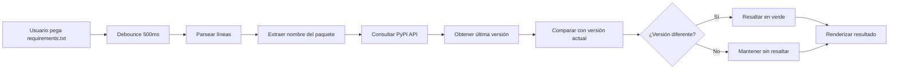

# 🔄 Requirements Updater

> **Actualiza automáticamente las dependencias de tu archivo `requirements.txt` de Python con las últimas versiones disponibles en PyPI**

[](https://party-tools.github.io/requirements-updater/)
[](https://github.com/Party-Tools/requirements-updater)
[](https://pypi.org/)

---

## 🌟 Características

- ✅ **Actualización automática**: Consulta PyPI para obtener las últimas versiones de paquetes
- 🎨 **Interfaz intuitiva**: Diseño dividido con entrada y salida lado a lado
- 🌓 **Modo oscuro**: Cambia entre tema claro y oscuro según tu preferencia
- 🔍 **Resaltado visual**: Los paquetes actualizados se destacan automáticamente
- ⚡ **Sin instalación**: 100% cliente, funciona directamente en el navegador
- 📋 **Editable**: El resultado es editable para ajustes manuales
- 🚀 **Rápido y eficiente**: Usa debouncing para optimizar las consultas a la API

---

## 🚀 Uso

### 🌐 Online (Recomendado)

1. Visita: **[https://party-tools.github.io/requirements-updater/](https://party-tools.github.io/requirements-updater/)**
2. Pega tu archivo `requirements.txt` en el panel izquierdo
3. Espera unos segundos mientras se consultan las últimas versiones
4. Copia el resultado actualizado del panel derecho

### 💻 Local

1. Clona el repositorio:
   ```bash
   git clone https://github.com/Party-Tools/requirements-updater.git
   cd requirements-updater
   ```

2. Abre `index.html` en tu navegador:
   ```bash
   open index.html  # macOS
   xdg-open index.html  # Linux
   start index.html  # Windows
   ```

---

## 📋 Ejemplo de Uso

### Entrada (Panel Izquierdo)
```txt
flask==2.0.1
requests==2.26.0
pandas==1.3.0
numpy==1.21.0
```

### Salida (Panel Derecho)
```txt
flask==3.0.0        # ✨ Actualizado (resaltado en verde)
requests==2.31.0    # ✨ Actualizado (resaltado en verde)
pandas==2.1.4       # ✨ Actualizado (resaltado en verde)
numpy==1.26.3       # ✨ Actualizado (resaltado en verde)
```

---

## 🛠️ Tecnologías

- **HTML5**: Estructura semántica
- **CSS3**: Variables CSS, diseño responsivo, modo oscuro
- **JavaScript (Vanilla)**: 
  - API Fetch para consultas a PyPI
  - Debouncing para optimización
  - Manipulación del DOM

---

## 🏗️ Arquitectura

### Flujo de Trabajo



### Componentes Principales

1. **Input Handler**: Maneja la entrada del usuario con debouncing
2. **PyPI Fetcher**: Consulta la API de PyPI para obtener versiones
3. **Version Comparator**: Compara versiones actuales vs. últimas
4. **Output Renderer**: Renderiza el resultado con resaltado

---

## 🎨 Diseño

### Paleta de Colores

#### Modo Claro
- **Background**: `#f0f0f0`
- **Container**: `#ffffff`
- **Text**: `#000000`
- **Updated**: `#90EE90` (verde claro)

#### Modo Oscuro
- **Background**: `#2c2c2c`
- **Container**: `#363636`
- **Text**: `#e0e0e0`
- **Updated**: `#4CAF50` (verde intenso)

### Layout

- **Diseño Flexbox**: Dos paneles de igual tamaño
- **Responsive**: Adaptable a diferentes tamaños de pantalla
- **Textarea Monoespacio**: Para mejor legibilidad del código

---

## 🔧 Funcionalidades Técnicas

### API de PyPI

La herramienta consulta la API oficial de PyPI:

```javascript
const response = await fetch(`https://pypi.org/pypi/${packageName}/json`);
const data = await response.json();
const latestVersion = data.info.version;
```

### Debouncing

Implementa un debounce de 500ms para evitar consultas excesivas:

```javascript
inputElement.addEventListener('input', debounce(updateRequirements, 500));
```

### Manejo de Errores

- Captura errores de red
- Maneja paquetes no encontrados
- Añade comentarios de error en el output

---

## 📦 Estructura del Proyecto

```
requirements-updater/
├── index.html          # Aplicación completa (HTML + CSS + JS)
├── README.md           # Documentación (este archivo)
└── requirements-updater.agent.md  # Agente personalizado
```

---

## 🤝 Contribuciones

Las contribuciones son bienvenidas. Por favor:

1. Fork el proyecto
2. Crea una rama para tu feature (`git checkout -b feature/AmazingFeature`)
3. Commit tus cambios (`git commit -m 'Add some AmazingFeature'`)
4. Push a la rama (`git push origin feature/AmazingFeature`)
5. Abre un Pull Request

---

## 🐛 Problemas Conocidos

- La API de PyPI puede tener límites de tasa (rate limiting)
- Paquetes privados o no públicos no serán encontrados
- Requiere conexión a internet activa

---

## 🔮 Roadmap

- [ ] Soporte para diferentes formatos (`>=`, `~=`, `!=`)
- [ ] Exportación directa del archivo actualizado
- [ ] Historial de actualizaciones
- [ ] Comparación de changelogs
- [ ] Soporte para `pipenv` y `poetry`
- [ ] Análisis de vulnerabilidades de seguridad
- [ ] Opción de actualización selectiva

---

## 📄 Licencia

Este proyecto está bajo licencia MIT. Ver archivo `LICENSE` para más detalles.

---

## 👨‍💻 Autor

**Party Tools** - [GitHub Organization](https://github.com/Party-Tools)

---

## 🎨 Design Variants

Este proyecto incluye **25 variantes de diseño únicas** en la carpeta `design-variants/`:
- Desde Glassmorphism hasta Brutalist
- Desde Cyberpunk hasta Paper Scrapbook
- Cada una con su propia personalidad y estética

[Ver todas las variantes →](design-variants/)

---

## 🙏 Créditos y Agradecimientos

Este proyecto es un fork del excelente trabajo original de **[@azurda](https://github.com/azurda)**:

**Repositorio Original:** [azurda/azurda.github.io](https://github.com/azurda/azurda.github.io)

### Gracias especiales a:
- 🌟 **azurda** por crear la herramienta original y la idea innovadora
- 💡 La implementación inicial y el concepto base son obra de azurda
- 🎨 Este fork añade variantes de diseño y mejoras adicionales sobre su trabajo

---

## 💖 Apoyo

Si encuentras útil esta herramienta, considera apoyar al autor original:

[](https://ko-fi.com/entangle)

---

## 🔗 Enlaces Útiles

- **Demo Live**: https://party-tools.github.io/requirements-updater/
- **Repositorio**: https://github.com/Party-Tools/requirements-updater
- **PyPI**: https://pypi.org/
- **Documentación pip**: https://pip.pypa.io/

---

## 📊 Estadísticas

- **Tamaño**: ~7KB (archivo único)
- **Dependencias**: 0 (puro HTML/CSS/JS)
- **Compatibilidad**: Todos los navegadores modernos
- **Rendimiento**: <100ms por paquete (depende de la red)

---

## 🙏 Agradecimientos Adicionales

- **[@azurda](https://github.com/azurda)** - Creador original del proyecto base
- PyPI por su API pública
- La comunidad de Python
- Contribuidores y usuarios del proyecto
- Todos los que apoyan el desarrollo de herramientas open source

---

**¿Preguntas o sugerencias?** Abre un [issue](https://github.com/Party-Tools/requirements-updater/issues) en GitHub.
