# 📸 Design Variants Screenshots

This folder contains screenshots of all 15 design variants for the Python Requirements Updater.

## Screenshots Gallery

### 1. Glassmorphism Modern
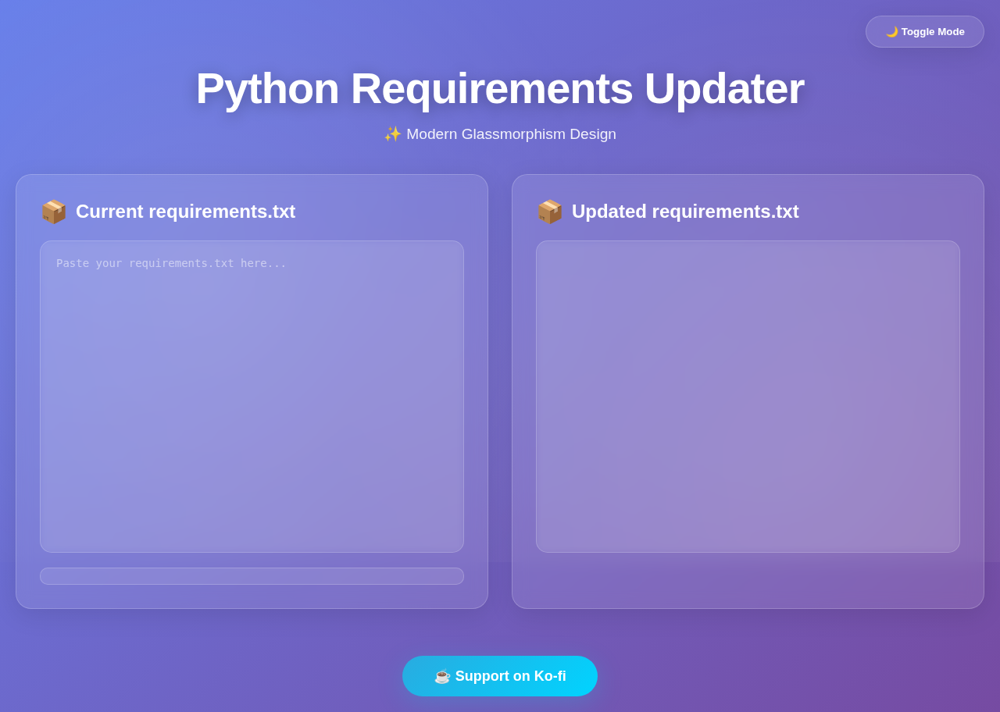
*Frosted glass blur effects with gradient backgrounds*

### 2. Cyberpunk Neon
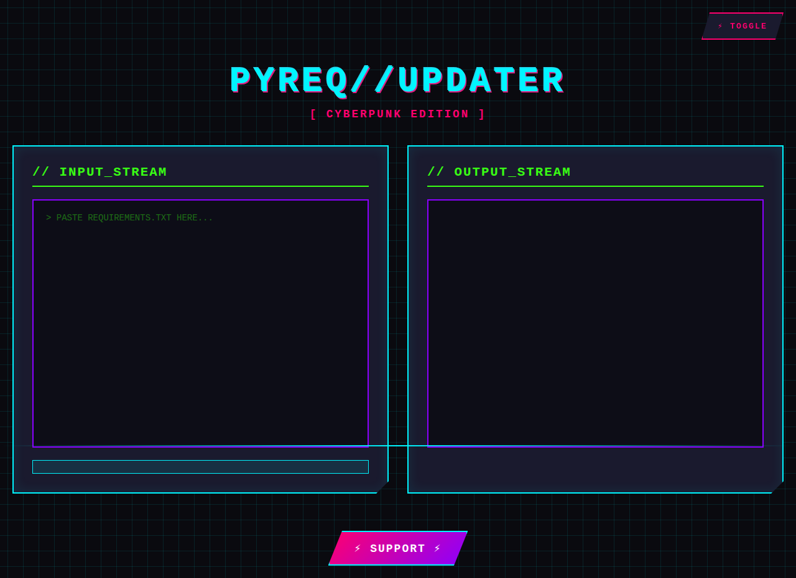
*High-contrast neon colors with glitch animations*

### 3. Minimalist Nordic

*Clean Scandinavian design with peaceful colors*

### 4. Gradient Wave
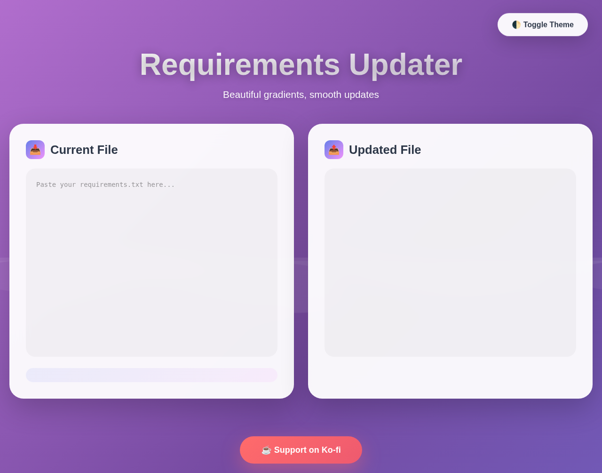
*Animated SVG waves with flowing colors*

### 5. Neumorphism Soft
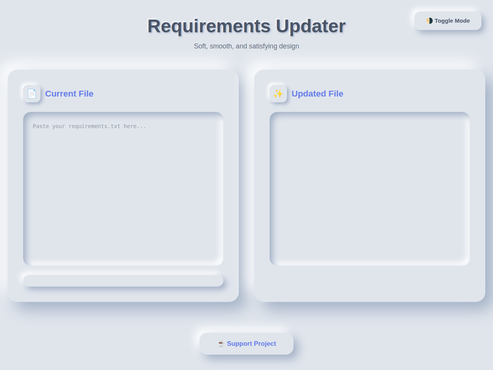
*Soft shadows with tactile depth*

### 6. Material Design 3
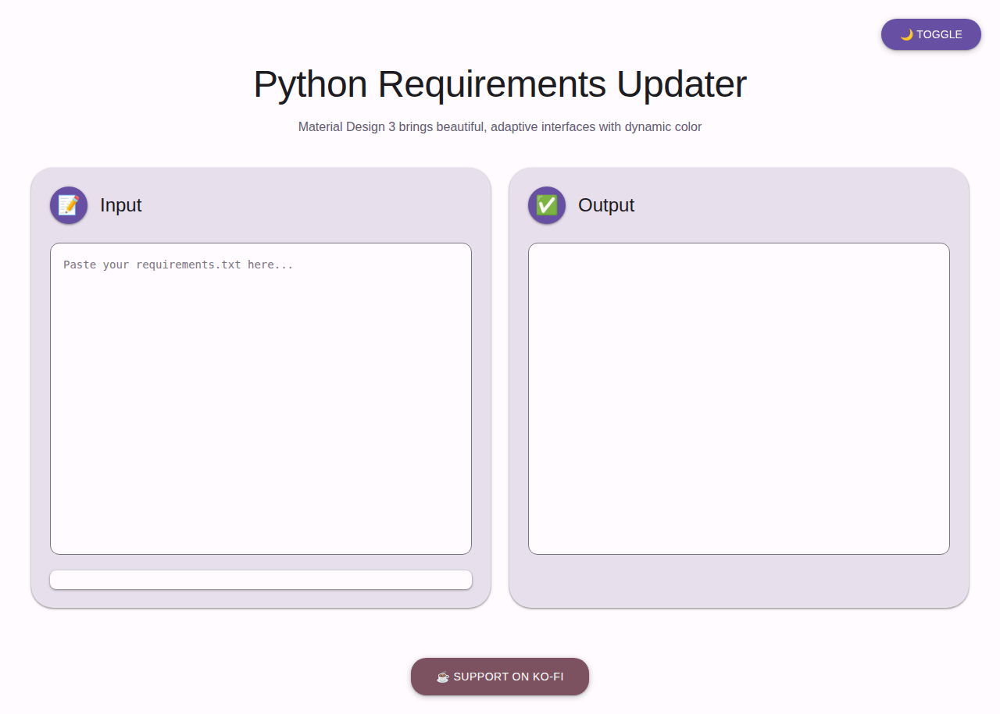
*Google's Material You design system*

### 7. Retro Terminal
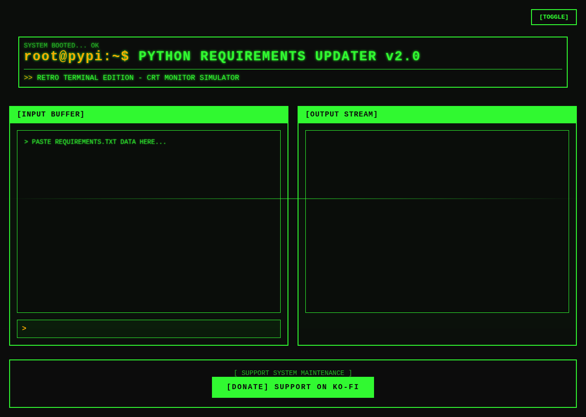
*CRT scanlines with monospace green-on-black*

### 8. Elegant Dark Premium

*Dark luxury with gold accents*

### 9. Colorful Playful
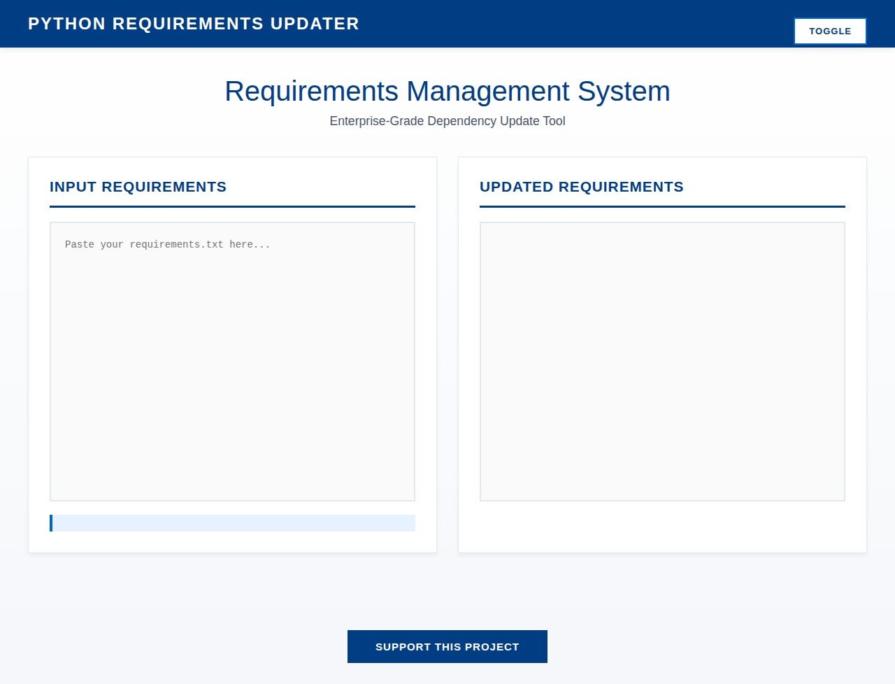
*Rainbow gradients with bounce animations*

### 10. Professional Corporate
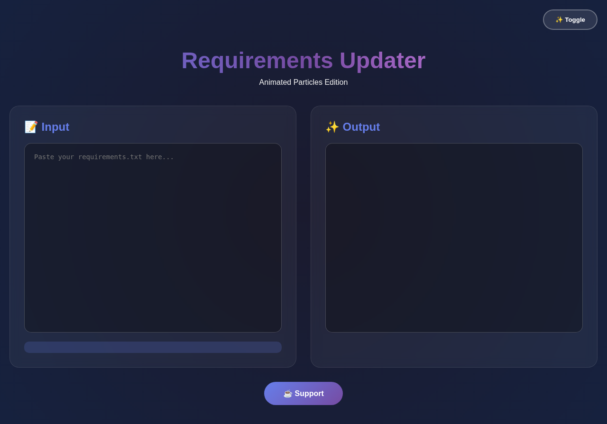
*Business blue with clean grid layout*

### 11. Animated Particles
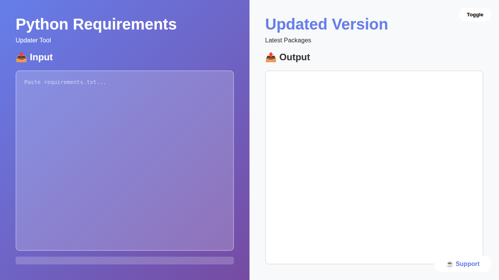
*Canvas particle background animation*

### 12. Split Screen Modern
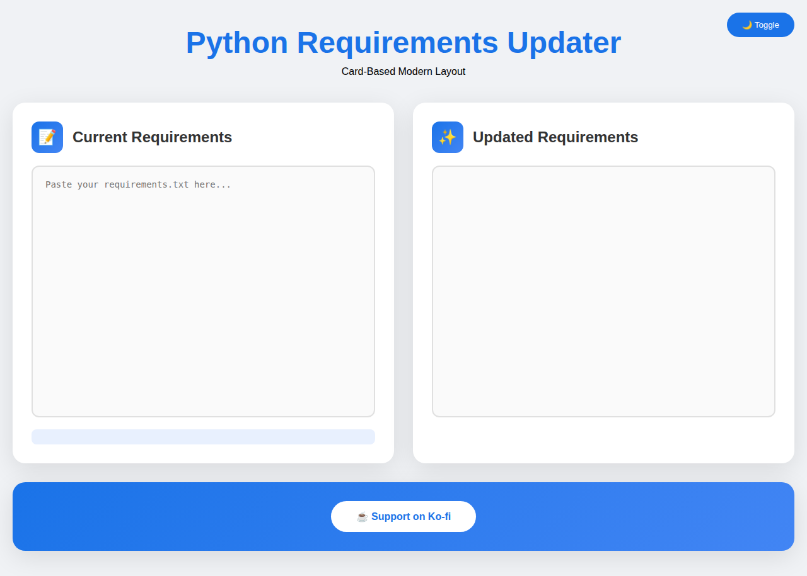
*50/50 contrast panels layout*

### 13. Card-Based Layout
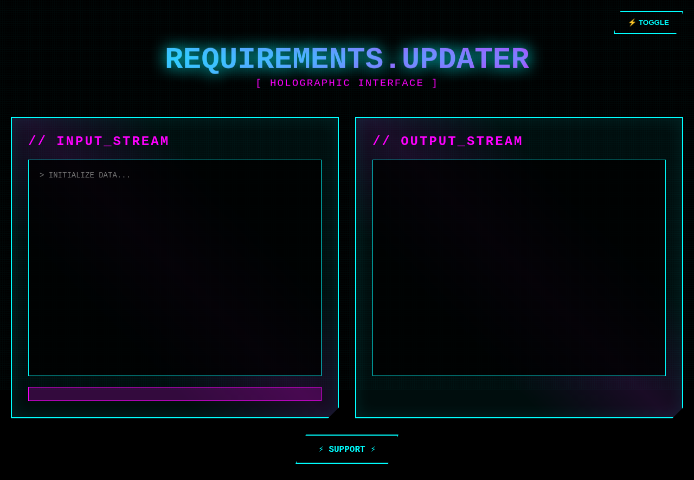
*Material-inspired elevated cards*

### 14. Futuristic Holographic
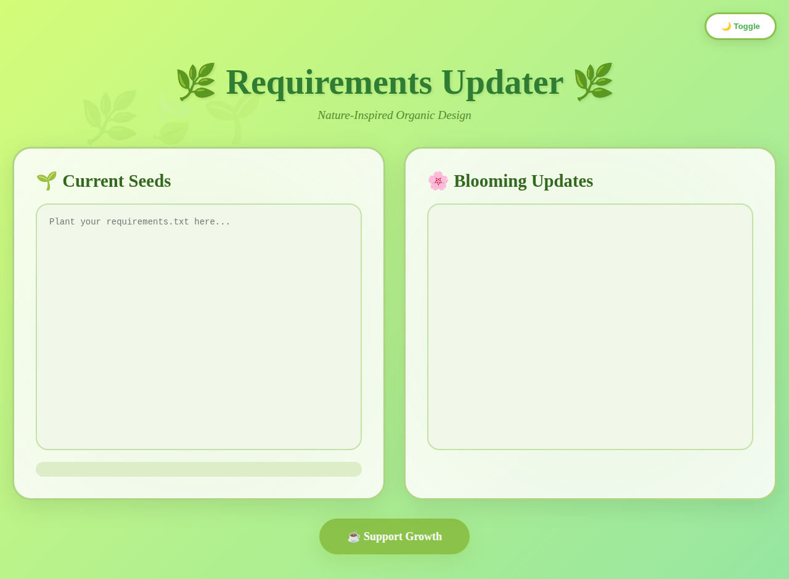
*Sci-fi cyan/magenta with glowing effects*

### 15. Nature-Inspired Organic

*Earth tones with plant themes*

---

## Usage

These screenshots are referenced in the main README and gallery index. They help users quickly compare different design aesthetics before testing the live variants.

All screenshots are full-page captures showing the complete design of each variant.
